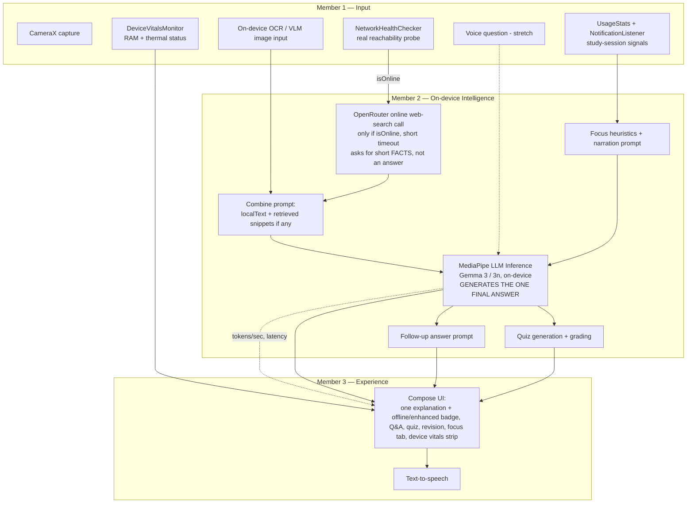

# StudyLens — iQOO Hackathon 2026 (Chennai Leg) Implementation Plan

**Team bucket:** Professionals · Own idea (registered on Reskilll)
**Event window:** 12 Sept 11:00 → 13 Sept 09:00 (22h build, Red/Green Light format) → Top 10 pitches
**Device:** iQOO 15 (Snapdragon 8 Elite Gen 5 + Q3 chip, 16GB LPDDR5X, on-device LLM capable)
**Team size:** 3

> Sources: hackathon playbook photos (Format, Rules & Guidelines, About iQOO), the registered project doc on content.reskilll.com (offline AI study companion), and the two earlier research docs (`deep-research-studylens-productivity.md`, `deep-research-report.md`).

---

## 0. What changed from the first draft of this plan

The first draft of this plan centered the whole product on "explain why your focus breaks" (a phone-usage-pattern coach). That is **not** what's registered on Reskilll. Your actual registered idea is:

> **StudyLens is an offline AI study companion.** A student points their phone camera at a textbook page or handwritten problem; the app reads it, explains it out loud in simple language, answers follow-up questions by voice, and generates a short quiz to check understanding — entirely on-device, with zero internet dependency. Built for tier-2/tier-3 students who own a smartphone but don't have reliable data.

This is now the **main product**. The usage-pattern/focus research is folded in as a secondary feature — **Focus Insights** — that explains *why a study session broke down* (app-switching, notification interruptions) using the same on-device signals and the same on-device LLM you're already building for tutoring. It reuses real research and real code, it's just no longer the headline.

## 1. What the rules actually require (unchanged from before, repeated for reference)

- **Red Light / Green Light, ~22h window, roughly 55/45 green/red.** Green = laptop + phone freely. Red = laptop restricted/monitored; work continues on the phone, or via **Office Kit** when strictly necessary.
- **HackTracker** runs the whole time, logging phone-use, model inference calls/tokens/thermals, crashes/tamper. Don't interfere with it.
- **Original work only**, built during the event window. OSS libraries/models are fine with attribution; a pre-built app is not.
- **Submit repo + demo assets on Reskilll before the hard cutoff** (repos lock before Top 10 pitches). Confirm the exact time at the venue. Push at the end of every Green Light window.
- **Judging weights:** End product 30% · Novelty 20% · Creative phone use 15% · Technical depth 15% · Office Kit 10% · Demo 10%.
- **"Tip to Win":** apps that run locally and on-device — *including the backend* — using on-device LLMs earn bonus points.
- **OpenRouter credits** = a coding-productivity tool for the team while building (vibe-coding assistance), **not** the shipped app's inference backend. The shipped app must run its AI on-device to score on Novelty/Technical depth/Tip-to-Win.

## 2. The pitch, in one line

> **StudyLens turns any phone camera into an offline AI tutor — reads a page, explains it, answers your questions, quizzes you — no internet required. And because it watches how you study, it also tells you why your focus broke.**

Primary novelty: **offline-first accessibility**. Every existing AI tutoring app assumes a data connection; StudyLens is built for the tier-2/tier-3 student who doesn't have one. This is a real, defensible, judge-legible differentiator, and it lines up exactly with what this hackathon rewards (on-device LLM as the actual backend, not a demo gimmick).

Secondary novelty (Focus Insights, byproduct): most study/screen-time tools report *what* happened (Digital Wellbeing, RescueTime); StudyLens explains *why* a session broke down, using the same on-device LLM, scoped specifically to study sessions rather than being a generic phone-usage tracker.

## 3. Feature scope for 22 hours

### Primary pipeline (must-have — this is the registered idea, build this first)
1. **Capture:** camera photo of a textbook page or handwritten problem (CameraX).
2. **Read:** extract the content on-device.
3. **Explain:** on-device LLM turns the extracted content into a simple explanation.
4. **Speak:** on-device text-to-speech reads the explanation aloud.
5. **Ask:** the student can ask a follow-up question (typed as the safe default, voice as a stretch — see §4) and get an on-device-generated answer.
6. **Quiz:** the app generates 1–3 short questions from the material; wrong answers are tracked for revision.

### Secondary feature (must-have, but scoped small — Focus Insights)
- During/around study sessions, surface 1–2 evidence-backed observations using the same signals from the original research (app switches away from StudyLens, notifications arriving mid-session), narrated by the same on-device LLM. Example: *"You stayed on this problem for 6 minutes before switching to Instagram — sessions without a switch tend to finish 2x faster."* Lives on its own tab/card — clearly secondary in the UI and in the pitch.

### Explicitly out of scope for 22 hours
- Full handwriting OCR robustness (best-effort only — printed text is the reliable path, see §4).
- Voice-only interaction as the *only* path (always keep typed fallback).
- Spaced-repetition scheduling, multi-day revision plans, accounts/sync.
- Clustering/ML training, multi-week trend modeling for Focus Insights — stick to simple heuristics like the original research plan.

## 3a. Hybrid Offline/Online RAG Pipeline (NEW — this is the #1 priority for the 7 PM checkpoint)

**The scenario:** a student may be somewhere with zero network coverage. The app must still fully work — using only the **on-device model running on the phone's own chip (NPU/GPU)**, no internet at all. **If** the phone does have a real, working connection, the app should get smarter: fetch extra, up-to-date context from the web, blend it with what the camera captured, and let the **local model produce one final, better answer** — not two separate answers shown side by side.

This is a standard **RAG pattern** (Retrieval-Augmented Generation): *retrieve* extra context when possible, then *generate* the final answer. The only twist here is that retrieval (when available) happens via a cloud call, but generation always happens on the phone.

**The rule that matters for scoring:** offline-on-device is the **default and primary path** — that's what the hackathon explicitly rewards ("Tip to Win"). Online retrieval is a **bonus input, not a bonus output** — it must never block, slow down, or replace the local model's ability to answer if the network check fails or the web call is slow.

**Flow:**
1. Photo captured → text extracted (Member 1, unchanged): `localText`.
2. **`NetworkHealthChecker`** (Member 1): a real reachability check — not just "is Wi-Fi/mobile data on," but "can we actually reach the internet right now." Exposes `isOnline: Boolean`.
3. **Retrieval step (only if `isOnline == true`):** Member 2 sends the topic/`localText` to OpenRouter's web-search-grounded model (the `:online` suffix), explicitly asking for **short factual snippets, not a full explanation** — this is the "go check the web/documents for current info" step, done with a single short-timeout HTTP call instead of building custom browsing automation. If this fails or is slow, it's simply skipped — no error shown.
4. **Combine step:** Member 2 builds one prompt containing `localText` + (the retrieved snippets, if step 3 succeeded).
5. **Generation step (always runs, this is the core guarantee):** that combined prompt goes to the **on-device Gemma model** via MediaPipe — it produces **one final response**, in the app's own consistent tutor voice, whether or not online context was available.
6. Member 3 shows that one response, with a small badge: **"📴 Offline answer"** vs **"📡 Enhanced with live info."** This is still a strong live-demo moment: toggle airplane mode and show the *same* question producing a plain vs. a richer answer.

## 3b. Maximize genuine on-device compute usage (RAM/NPU/thermal) — a real, separate scoring signal

The rules say HackTracker "reads model outputs, and logs inference calls, tokens and thermals in real time," and the event's own pitch is that "the device is the compute platform, not just something you deploy to." That means **how hard and how visibly you use the phone's own chip is being watched**, on top of whether the features work. This doesn't change what the app does — it changes a few implementation choices so the on-device story is real and demonstrable, not just technically true.

**Decisions:**
- **Use hardware acceleration explicitly, not the default CPU path.** When configuring MediaPipe's `LlmInference`, set the backend to GPU (`LlmInference.LlmInferenceOptions.builder().setPreferredBackend(LlmInference.Backend.GPU)` or the equivalent in whatever SDK version you land on) so inference actually runs on the Snapdragon's accelerated path instead of falling back to plain CPU. Verify this is actually happening (see the vitals indicator below), don't just assume it.
- **Model size: safe default now, heavier stretch later.** For the 7 PM checkpoint, stick with the plan's existing safe choice (Gemma 3 1B int4 — see §4). *After* 7 PM, if the core is stable, try stepping up to a larger quantized variant (e.g. Gemma 3n E4B or Gemma 3 4B) — the iQOO 15's 16GB RAM can likely take it, and a bigger genuine model is a stronger "technical depth" and "creative phone use" story. Use the same checkpoint discipline as the Plan A/B decision in §4: if the bigger model causes lag, crashes, or visible thermal throttling, fall back to the 1B model without hesitation — a smaller model that works beats a bigger one that doesn't.
- **Show it, don't just claim it.** Add a small, visible "Device Vitals" readout in the app (RAM in use, thermal status, tokens/sec of the last inference) — see Member 1 and Member 2's files for who owns which part, and Member 3's file for where it's displayed. This is both a genuine debugging tool and a strong live-demo proof point: judges and HackTracker both get to see the phone actually working, not just a screen with text on it.
- **Keep the cloud retrieval call minimal.** It should stay a short, occasional lookup for a few facts (§3a) — the bulk of the compute, the bulk of the demo, and the bulk of the story should visibly be the phone itself.

## 4. The one architecture decision to make in the first hour: VLM vs OCR+LLM

Your registered doc says "an on-device vision-language model reads and understands the content." There are two ways to deliver that, with very different risk profiles:

| | **Plan A — true on-device VLM** | **Plan B — OCR + text LLM** |
|---|---|---|
| How | Gemma 3n (multimodal, image+text) via MediaPipe LLM Inference, image passed directly to the model | ML Kit Text Recognition (on-device OCR) extracts text → same text-only Gemma 3 model explains it |
| Matches registered pitch | Exactly | Functionally equivalent output, slightly less literal |
| Risk | Higher — multimodal on-device inference is newer, less documented, more likely to eat hours debugging | Low — both ML Kit OCR and text-only Gemma are mature, well-documented, fast to integrate |
| Technical depth score | Higher if it works | Still solid — OCR + LLM is a legitimate on-device pipeline |

**Recommendation:** attempt Plan A first, but set a hard checkpoint — **if the VLM pipeline isn't producing a correct explanation from a real photo by the end of Window 1 (14:00)**, fall back to Plan B without further debate. A working OCR+LLM demo beats a half-working VLM demo. Member 2 owns this decision and this checkpoint (see their file).

## 5. Architecture



No network calls anywhere in this loop except the one-time model asset download, staged before/at the very start of the event.

## 6. Tech stack

| Layer | Choice | Why |
|---|---|---|
| Language/UI | Kotlin + Jetpack Compose | fastest path to a clean UI in limited hours |
| Camera | CameraX | standard, well-documented capture API |
| Content reading | Gemma 3n multimodal (Plan A) via MediaPipe, fallback to ML Kit Text Recognition + Gemma 3 1B text (Plan B) | see §4 |
| On-device LLM | MediaPipe LLM Inference API (`com.google.mediapipe:tasks-genai`) | official Android on-device LLM path, matches "Tip to Win," HackTracker-observable; uses the Snapdragon's GPU/NPU acceleration automatically — mention the Q3 chip in the pitch even if you don't hand-tune the delegate |
| Connectivity check | `ConnectivityManager` + a short timed reachability probe (real HTTP request, not just "is Wi-Fi on") | bars-showing ≠ working internet, especially in low-coverage areas — this is the whole point of the feature |
| Device vitals | `PowerManager.getCurrentThermalStatus()` (thermal), `ActivityManager.getMemoryInfo()` / `Debug.getMemoryInfo()` (RAM) | proves genuine, sustained on-device compute usage — a real signal HackTracker and judges are both watching for |
| Online retrieval (bonus input only) | OpenRouter web-search-enabled model (`:online` suffix, e.g. a Sonar/Perplexity-style model) called only when genuinely online, short timeout, asked for short factual snippets (not a full answer) — this is the "retrieval" half of a RAG pipeline | uses the hackathon-provided OpenRouter credits as an actual app feature, not just a coding aid; no LangGraph/browser-automation server needed, avoids a live-server dependency during the demo |
| Voice out | Android `TextToSpeech` (built-in, offline once voice data is present) | zero setup risk |
| Voice in (stretch) | Android `SpeechRecognizer` with `EXTRA_PREFER_OFFLINE`, offline language pack pre-downloaded | keep typed input as the non-stretch fallback |
| Local storage | Room (SQLite) | study captures, explanations, quiz attempts, focus events/sessions |
| Background work | WorkManager + foreground service for NotificationListener | for the Focus Insights signal collection |
| Dev productivity | OpenRouter credits for AI-assisted coding while building | not shipped in the app |

**Compliance note:** you may reference official MediaPipe/ML Kit sample apps to learn the APIs, but the app itself must be built during the event window — only the SDKs/models are pre-existing dependencies (credit them in the README).

## 7. Data model (shared contract — agree on this in the first 15 minutes)

```kotlin
// Primary pipeline
data class StudyCapture(
    val id: Long,
    val extractedText: String,     // from OCR, or empty if VLM consumes the image directly
    val timestamp: Long
)

data class Explanation(
    val captureId: Long,
    val simpleExplanation: String,
    val topic: String              // inferred tag, used for revision tracking
)

// Hybrid offline/online RAG result (see §3a) — ONE final answer, not two
data class ExplanationResult(
    val captureId: Long,
    val finalExplanation: String,   // always present — produced by the local model, using local text + (if available) retrieved online context
    val usedOnlineContext: Boolean  // true if retrieval succeeded and was blended into the prompt before generation
)

data class QuizQuestion(
    val id: Long,
    val captureId: Long,
    val topic: String,
    val question: String,
    val options: List<String>?,    // null = short-answer
    val correctAnswer: String
)

data class QuizAttempt(
    val questionId: Long,
    val userAnswer: String,
    val isCorrect: Boolean,
    val timestamp: Long
)

// Focus Insights (secondary feature)
data class AppEvent(val id: Long, val packageName: String, val eventType: Int, val timestamp: Long)
data class NotificationEvent(val id: Long, val packageName: String, val timestamp: Long)
data class StudySession(
    val id: Long,
    val startTime: Long,
    val endTime: Long,
    val durationMs: Long,
    val switchCount: Int,
    val notificationCount: Int
)
data class FocusInsight(
    val type: String,
    val evidence: String,          // e.g. "6 min before first switch, 2x faster finish without one"
    var narrative: String? = null  // filled by the same on-device LLM
)

// Device vitals (see §3b) — proof of genuine on-device compute, shown live in the UI
data class InferenceStats(
    val tokensPerSecond: Double,
    val latencyMs: Long,
    val ramUsedMb: Long,
    val thermalStatus: String   // e.g. "NONE" / "LIGHT" / "MODERATE" / "SEVERE"
)
```

## 8. Critical logistics — first 30–60 minutes of Green Light

1. **Download the Gemma model file(s) immediately** — Gemma 3n (multimodal, for Plan A) and Gemma 3 1B-IT int4 (text-only, for Plan B / focus narration) from Kaggle Models / LiteRT community models, in parallel on all three laptops. These are large; venue wifi is a real risk factor.
2. Push model files onto each iQOO 15 via `adb push` while still in Green Light.
3. If attempting voice input, pre-download the offline speech-recognition language pack on-device (Settings → Voice input) during Window 1.
4. Init the git repo + push an empty scaffold immediately.
5. Make the Plan A/B call by the end of Window 1 (§4) — don't let this drag.

## 9. ⚠️ URGENT: First evaluation is at 19:00 (7 PM) — core product must work by then

That lands right at the end of Window 4. Priority order for what must work by 19:00:

1. **#1 priority: the hybrid offline/online explain flow (§3a).** Capture → text → on-device explanation (works with zero network) → if genuinely online, an enriched web-augmented add-on. This is the headline feature for this checkpoint — demo it by toggling airplane mode.
2. **#2 priority, only if #1 is solid with time to spare: one quiz question.**

Cut everything else for speed:
- **Skip Plan A (VLM) — go straight to Plan B (OCR + text LLM).** Less risk, faster to get working, and that's what matters for a 7 PM deadline. Revisit Plan A only after eval 1 if there's spare time.
- **Skip voice input entirely for now.** Typed follow-up question only.
- **Skip Focus Insights entirely for now.** Build it after 19:00, for the second evaluation round / Top 10.
- Target: by 16:30 (end of Window 3) the hybrid explain flow should already work end-to-end. Window 4 (16:30–19:00, Red anyway, so no laptop) becomes on-device testing + demo rehearsal (practice the airplane-mode toggle!), not new feature work.

## 9a. Master timeline (Chennai leg grid)

| Window | Time | Type | Team focus |
|---|---|---|---|
| 1 | 11:00–14:00 | 🟢 Green (3h) | Repo/scaffold, model downloads, camera capture skeleton, **Plan A vs B checkpoint** |
| 2 | 14:00–15:30 | 🔴 Red (1.5h) | No-laptop: test capture flow on real textbook pages by hand; draft explain/quiz/focus prompts on paper/phone |
| 3 | 15:30–16:30 | 🟢 Green (1h) | Wire capture → reading pipeline (chosen plan) end-to-end for one real page |
| 4 | 16:30–19:00 | 🔴 Red (2.5h) | On-device: test with real textbook material as real users; note failure cases; start Focus Insights signal collection running in the background |
| 5 | 19:00–22:00 | 🟢 Green (3h) | Explanation + TTS working end-to-end; start quiz generation; wire Focus Insights heuristics |
| 6 | 22:00–01:00 | 🔴 Red (3h) | On-device QA of the full study flow; prompt tuning via short Office Kit bursts; commit |
| 7 | 01:00–06:30 | 🟢 Green (5.5h) | Quiz + revision tracking complete; Focus Insights tab wired to real data; stretch: voice Q&A; record demo video; build pitch deck |
| 8 | 06:30–09:00 | 🔴 Red (2.5h) | Final on-device QA, rehearse pitch on the actual iQOO 15, freeze code, final repo push before cutoff |
| — | ~09:00+ | — | Submit to Reskilll before hard cutoff; Top 10 pitch/demo on the iQOO phone if selected |

## 10. Team split (summary)

| Member | Owns | File |
|---|---|---|
| 1 | **Input** — camera capture, OCR/VLM image handling, voice input (stretch), Focus Insights raw signal collection (UsageStats/NotificationListener/screen), Room schema | `member1-android-core.md` |
| 2 | **Brain** — on-device LLM (MediaPipe/Gemma), explain/answer/quiz prompts, Plan A/B decision owner, Focus Insights heuristics + narration | `member2-insight-engine-llm.md` |
| 3 | **Output & Delivery** — TTS, Compose UI (study flow + focus tab), demo, pitch, HackTracker/Office Kit compliance, QA | `member3-ui-ux-demo.md` |

Input → Brain → Output is the whole pipeline; each member owns one stage end-to-end, which also makes for a clean 3-part pitch narrative.

## 11. Risk register

| Risk | Mitigation |
|---|---|
| VLM (Plan A) doesn't work reliably in time | Hard fallback checkpoint at end of Window 1 → Plan B (§4) |
| Model download fails/slow on venue wifi | Parallel downloads on all 3 laptops from minute 0; phone hotspot backup; prefer smallest viable model variants |
| Handwriting OCR is unreliable | Scope MVP demo to printed textbook pages; mention handwriting as a stretch/roadmap item, not a live-demo dependency |
| Offline voice input (STT) is flaky | Typed follow-up question is the default path; voice is a bonus if it works, never the only path |
| Not enough real focus-session data | Focus Insights heuristics should degrade gracefully with few sessions; consider a small labeled "sample session" fallback, clearly marked if used |
| LLM inference slow/thermal-throttles during sustained testing | Short prompts, cached model instance, templated non-LLM fallback text so nothing hangs on stage |
| Losing laptop access mid-fix during Red Light | Batch fixes, test the rest on-device, minimal purposeful Office Kit use |
| Missing the submission cutoff | Push at the end of every Green window; confirm exact cutoff time from organizers ASAP |
| Crash/tamper flags from HackTracker | Don't touch/interfere with it; keep the app itself crash-free (Member 3's QA pass) |
| Bigger model (post-7 PM stretch) causes lag/crashes/thermal throttling | Same checkpoint discipline as Plan A/B: try it, but fall back to Gemma 3 1B immediately if it's not stable — never risk the working demo for a bigger-number brag |

## 12. Submission checklist

- [ ] Repo README: problem (offline access gap), architecture diagram, tech stack, on-device model names + licenses/attribution, how to run
- [ ] Attribution for MediaPipe/Gemma/ML Kit and any other OSS used
- [ ] Demo video recorded on the iQOO 15 itself
- [ ] Pitch deck: Problem (no reliable internet) → Solution (offline AI tutor) → Live demo → Focus Insights as a bonus layer → Tech depth → Ask
- [ ] Final commit pushed before the hard cutoff, repo confirmed accessible on Reskilll
- [ ] No code path in the demo flow requires internet access

## 13. Pitch structure mapped to judging weights (if you reach Top 10)

- **End product (30%):** live demo — photograph a real page, hear it explained, answer a quiz question, no crashes.
- **Novelty (20%):** offline-first AI tutoring for connectivity-constrained students (the primary story) + "explains why focus broke" as a bonus layer (the secondary story) — two distinct, defensible angles in one product.
- **Creative phone use (15%):** camera + (voice) + on-device usage signals + on-device inference, all combined.
- **Technical depth (15%):** show the pipeline — capture → read (VLM or OCR) → explain/answer/quiz via on-device LLM → focus heuristics via the same LLM — and that it's quantized and running on-chip, zero network calls. Point at the live Device Vitals readout (RAM used, thermal status, tokens/sec) as concrete proof it's genuinely running on the phone's chip, not a trick.
- **Office Kit (10%):** be ready to state how little/how purposefully you used it.
- **Demo (10%):** rehearsed, on the actual device, lead with the primary pipeline, close with Focus Insights as the "and one more thing."
